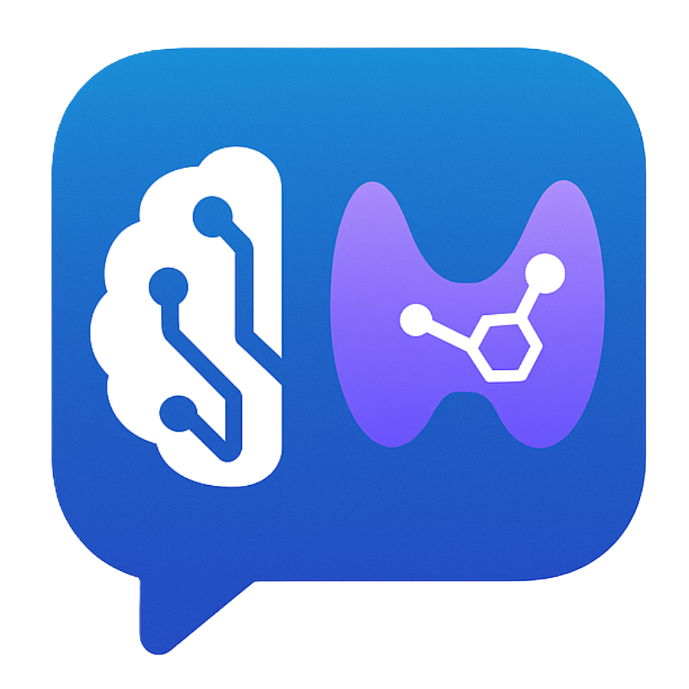

markdown# EndoChat

<p align="center">
 
</p>

EndoChat is an AI-powered assistant specializing in endocrinology, designed to provide accurate, patient-friendly information about endocrine disorders, treatments, and related medical topics. Built using Retrieval Augmented Generation (RAG) technology, EndoChat delivers contextually relevant responses derived from a curated knowledge base of endocrinology documents.

## 🌟 Features

- **Patient-Friendly Explanations**: Complex medical concepts translated into accessible language
- **Source Citations**: References to original documents with page numbers for verification
- **Multilingual Support**: Available in English, French, and Arabic
- **Document-Backed Responses**: Information retrieved from trusted endocrinology sources
- **PDF Document Integration**: Automatic processing of medical literature
- **Interactive Interface**: Clean, responsive design with voice input/output capabilities
- **Conversation Context**: Maintains dialogue history for coherent interactions
- **Image Support**: Displays relevant medical visualizations when available

## 🧪 Technology Stack

- **Backend**: Flask web server
- **RAG Pipeline**: LangChain for document processing
- **Vector Database**: Chroma for semantic document storage
- **Embeddings**: Sentence-transformers for high-quality document representations
- **LLM**: Groq API with Llama models for response generation
- **Frontend**: HTML, CSS, JavaScript with TailwindCSS

## 🛠️ Installation

### Prerequisites

- Python 3.9+
- [Groq API key](https://console.groq.com/docs/quickstart)
- PDF documents for the knowledge base

### Setup Steps

1. **Clone the repository**
  ```bash
  git clone https://github.com/OussHBZ/EndoChat.git
  cd EndoChat

Create and activate a virtual environment
bash# Create virtual environment
python -m venv env

# Activate on Windows
env\Scripts\activate

# Activate on macOS/Linux
source env/bin/activate

Install dependencies
bashpip install -r requirements.txt

Configure environment variables
bash# Copy the template
cp .env.template .env

# Edit the .env file with your Groq API key

Create required directories
bashmkdir -p data chroma_db conversations static/extracted_images

Add endocrinology documents
bash# Copy your PDF files to the data directory
cp /path/to/your/documents/*.pdf data/

Process documents to generate embeddings
bashpython load_data.py

Start the application
bashpython app.py

Access the application
Open your browser and navigate to: http://localhost:5000

🧑‍💻 Usage

Select your preferred language from the welcome screen
Ask endocrinology-related questions in the chat interface
View source documents by clicking on the "View Sources" button in responses
Download referenced PDFs directly from the source citations
Use voice input/output with the microphone and speaker buttons

🔧 Administration
Document Management
To update your knowledge base:
bash# Add new PDF files to the data directory
cp new_documents/*.pdf data/

# Process the new documents
python load_data.py
Database Reset
bash# Reset everything
python reset_database.py --all

# Reset only embeddings
python reset_database.py --embeddings

# Reset only conversation histories
python reset_database.py --conversations
⚙️ Customization
System Prompt
To modify how EndoChat responds:

Edit the find_document_similarity function in management/compare_texts.py

UI Customization

Replace static/img/endo_logo.png with your own logo
Modify static/css/style.css to change the appearance
Edit language settings in static/js/chat.js

🔍 Troubleshooting

No documents found? Ensure PDFs are placed in the /data directory
Embedding errors? Check Python environment for required packages
UI issues? Clear browser cache or try a different browser
Voice features not working? Check browser permissions for microphone access

📄 License
MIT License
🙏 Acknowledgements

LangChain for the RAG implementation
Groq for LLM API access
Sentence-Transformers for embedding models
Flask for the web framework
TailwindCSS for responsive styling


<p align="center">
  Made with ❤️ for better patient education in endocrinology
</p>
```